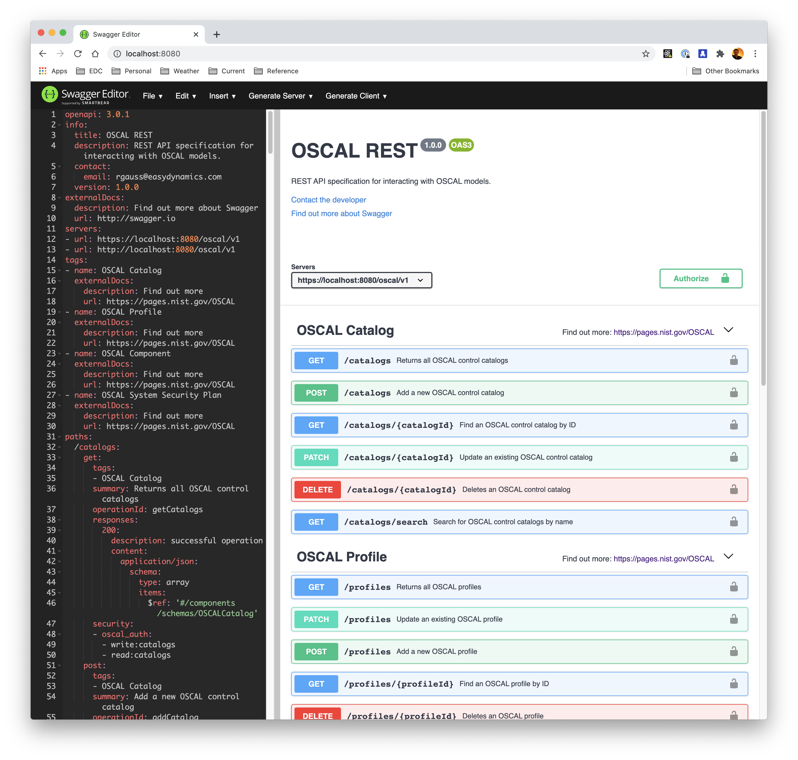

# OSCAL REST API Definition

A draft proposal from [Easy Dynamics](https://www.easydynamics.com) of an [OpenAPI](https://www.openapis.org/) REST specification for interacting with [OSCAL](https://pages.nist.gov/OSCAL/) models.
    
## Viewing / Editing
You can use a Swagger Editor, [local](https://github.com/swagger-api/swagger-editor) (Docker works great) or [online](https://editor.swagger.io/?url=https://raw.githubusercontent.com/EasyDynamics/oscal-rest/develop/openapi.yaml) to view the specification:

