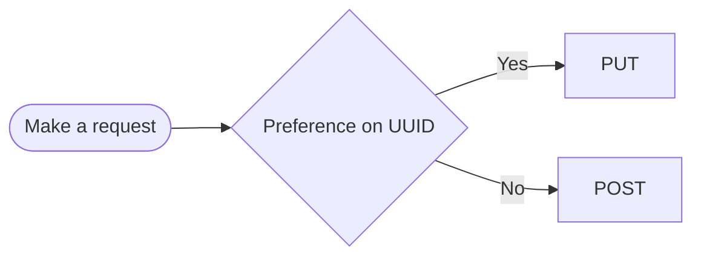
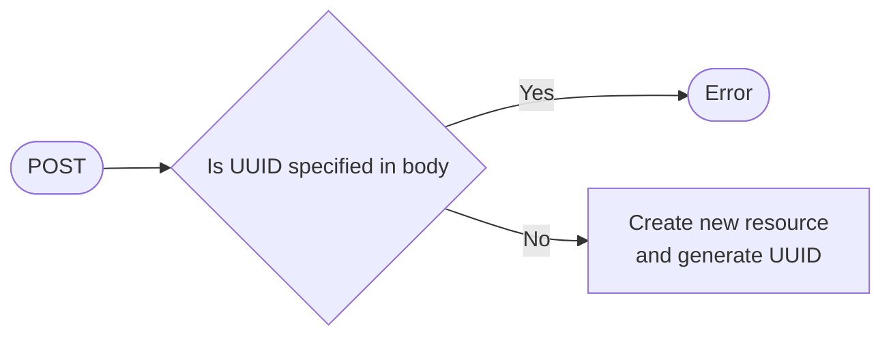
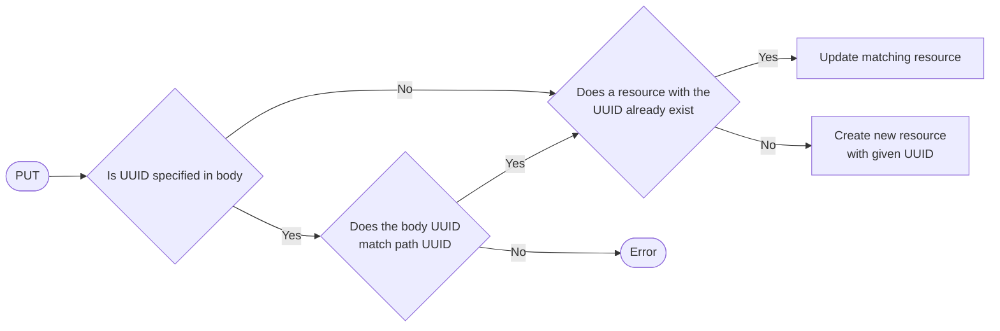

# Handling UUIDs in `POST` and `PUT` operations

## `PUT` vs `POST`

## `POST`

When creating new objects, `POST` is the preferred option. The UUID of the new object
does not need to be specified, so `POST` should be used when there is no UUID preference.
If the UUID is specified in the body, an HTTP 409 error will be returned.

### Making a `POST` request

## `PUT`

When creating new objects, `PUT` should only be used when there is a preferred value for
the UUID. Additionally, it can be used to update an existing object by replacing its entire
definition with an updated version. Currently, `PUT` is defined to include the UUID in the
request path and the request body, but it is not necessary to specify the UUID in the body.
If provided, the UUID in the body must match the UUID in the path, or else an HTTP 409
error will be returned. If an object with the specified UUID exists, the `PUT` request will
update the existing object. If no objects with the specified UUID exist, a new object will
be created with the provided UUID.

### Making a `PUT` request

